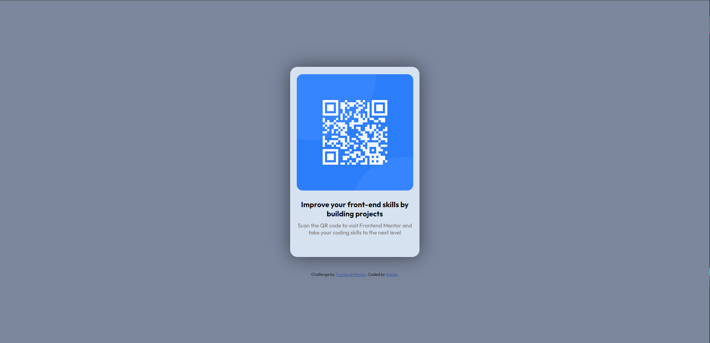

# Frontend Mentor - QR code component solution

This is a solution to the [QR code component challenge on Frontend Mentor](https://www.frontendmentor.io/challenges/qr-code-component-iux_sIO_H). Frontend Mentor challenges help you improve your coding skills by building realistic projects. 

## Table of contents

- [Overview](#overview)
  - [Screenshot](#screenshot)
  - [Links](#links)
- [My process](#my-process)
  - [Built with](#built-with)
  - ~~[What I learned](#what-i-learned)~~
  - [Continued development](#continued-development)
  - [Useful resources](#useful-resources)
- [Author](#author)
- [Acknowledgments](#acknowledgments)

## Overview

A site made for users to scan a QR code that directs users to the frontendmentor.io website.

### Screenshot

### Links

- Solution URL: [Github](https://github.com/r-ddle/QR-code-component-solution)
- Live Site URL: [Vercel](https://qr-code-component-solution-eight-rho.vercel.app/)

## My process

I had already made a small card like [site](https://r-ddle.netlify.app) so basically just copied the foundation of the container and card. Then the hard part was aligning and moving the text to a proper position without making them go into random places. I'm very new to web dev. so I had to search on google for everything 😅

### Built with

- HTML
- CSS
- Flexbox

### Continued development

I'm thinking of adding more to this site like some animations and effects even tho its just a QR code lol. Maybe when you like hover over the QR code you get the ability to veiw it in fullscreen or the background has a nice dark shade to it? somethings like that.

### Useful resources

- [Realtime Colors](https://www.realtimecolors.com/) - This helped me to pick the colors for the page (Until I realised I was already provided with a style-guide 😭)

## Author

- Website - [Riddle](https://www.your-site.com)
- Frontend Mentor - [@r-ddle](https://www.frontendmentor.io/profile/r-ddle)

## Acknowledgments

(Currently None)
